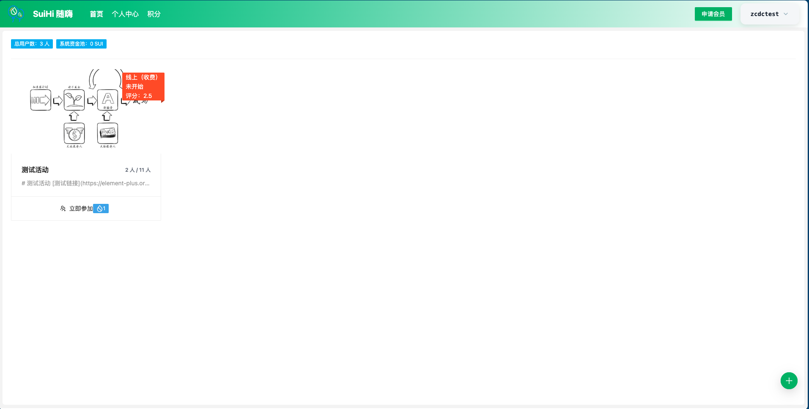
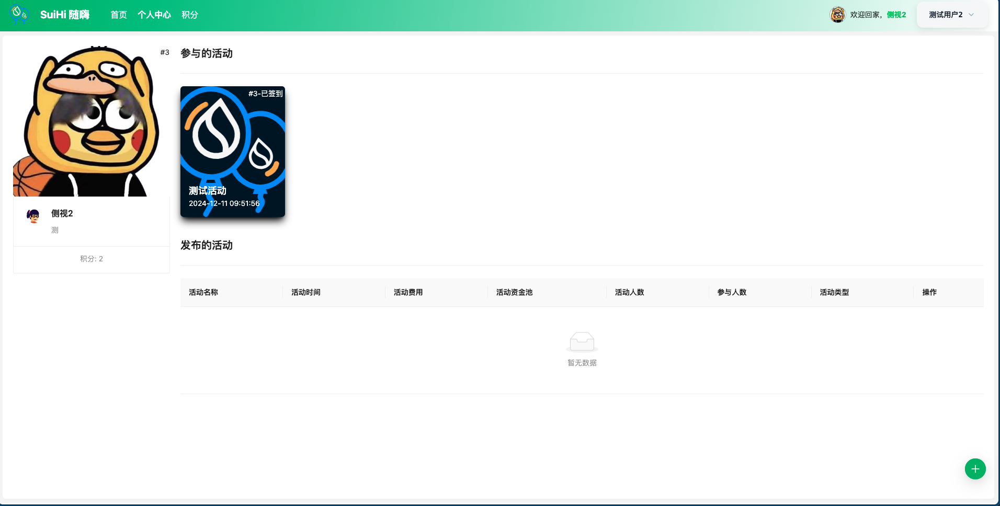
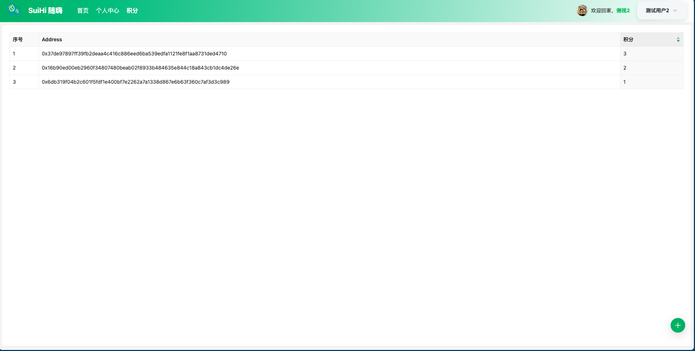
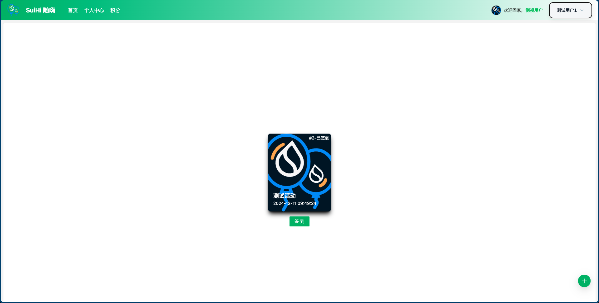
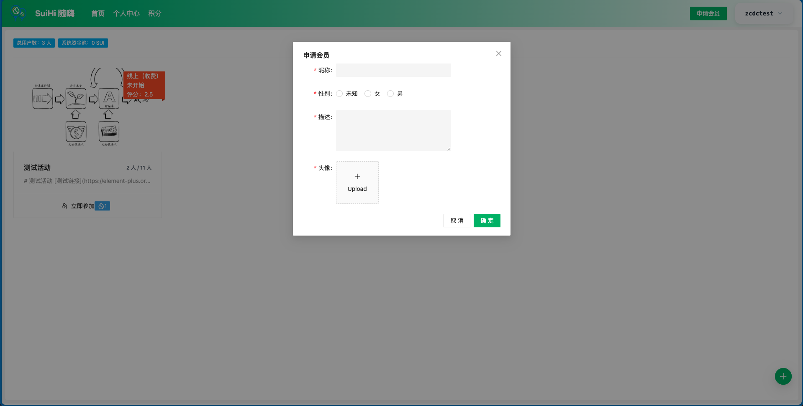
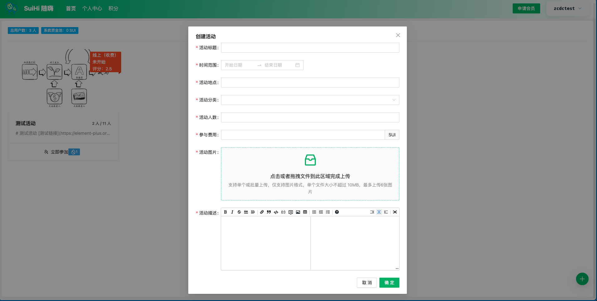
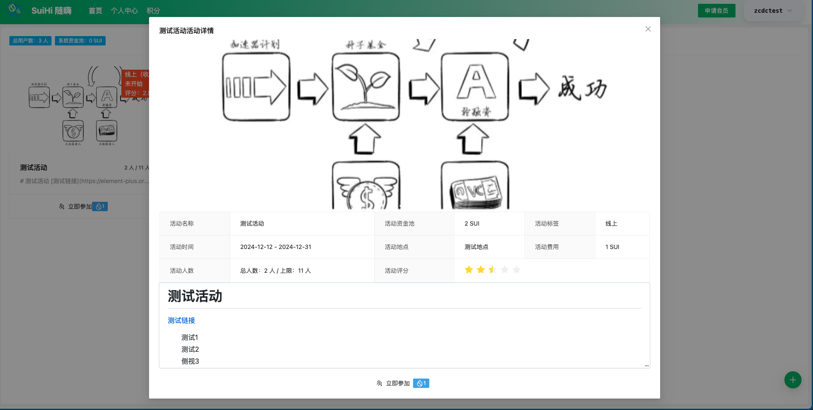

## project
- 项目名称: SuiHai 随嗨
> 描述: 活动发布平台，在申请会员之后，可以进行活动的发布、参与、签到和评分。活动发布可以设置费用，参与者缴纳后即可参与。活动发布者可对活动费用进行提取，但是平台需要收取手续费。活动发布者可以根据活动生成签到链接/二维码，参与者可以对参与的活动进行签到。所有交互都会产生积分，方便后续的奖励兑换。基于sui的合约进行活动和人员管理，基于walrus进行图片资源存储。

## Member
- klren0312  github: [https://github.com/klren0312](https://github.com/klren0312)
> 自我介绍&技术栈: 全干工程师 JavaScript

- EarthChen  github: [https://github.com/earthchen](https://github.com/earthchen)
> 自我介绍&技术栈: 全干工程师 Java

## Demo地址
[https://sui-hi.walrus.site/](https://sui-hi.walrus.site/)

## 页面截图

- 首页

- 个人中心

- 积分列表

- 签到页

- 申请会员

- 创建活动

- 活动详情

